# 🛍️ E-Commerce Funnel Analysis

> **Tools:** Python · SQL (SQLite) · Power BI · Excel · Pandas · Plotly  
> **Dataset:** Olist Brazilian E-Commerce Dataset (99,441 orders, 2016–2018)  
> **Business Question:** Where do customers drop off in the order journey, 
> and what factors drive customer satisfaction and retention?

---

> 🚀 **Live Demo:** [Open Streamlit Dashboard](https://purvaja11-ecommerce-funnel-analysis.streamlit.app/)

---

## 📊 Power BI Dashboard

### Overview
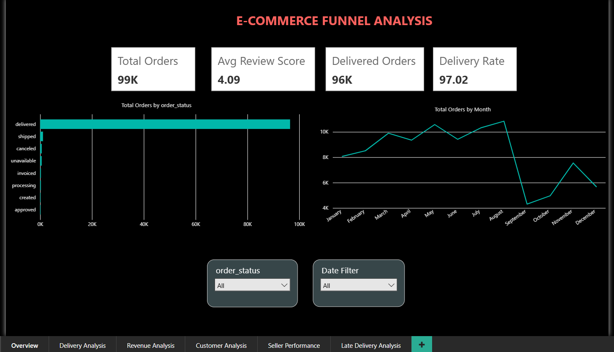

### Delivery Analysis
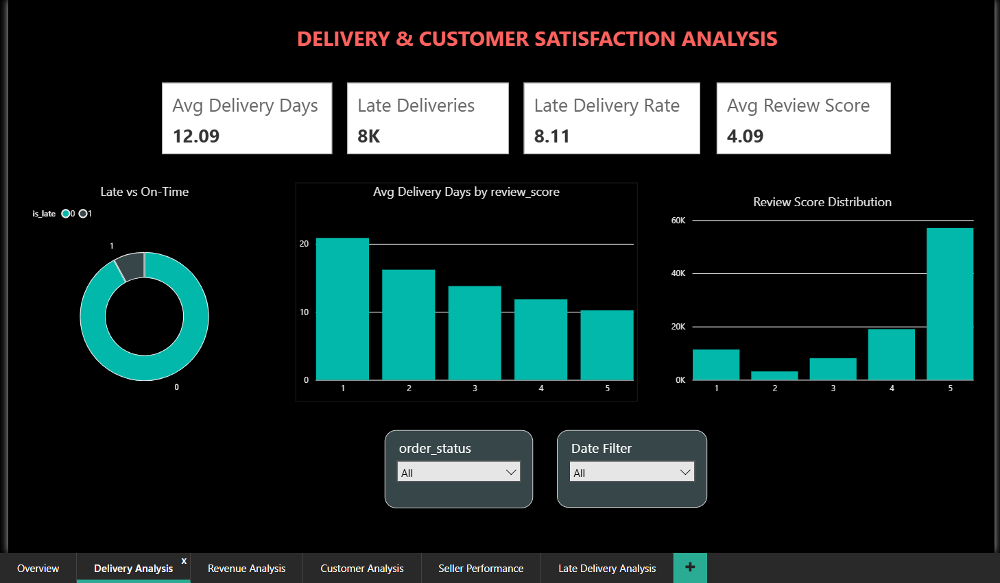

### Revenue Analysis
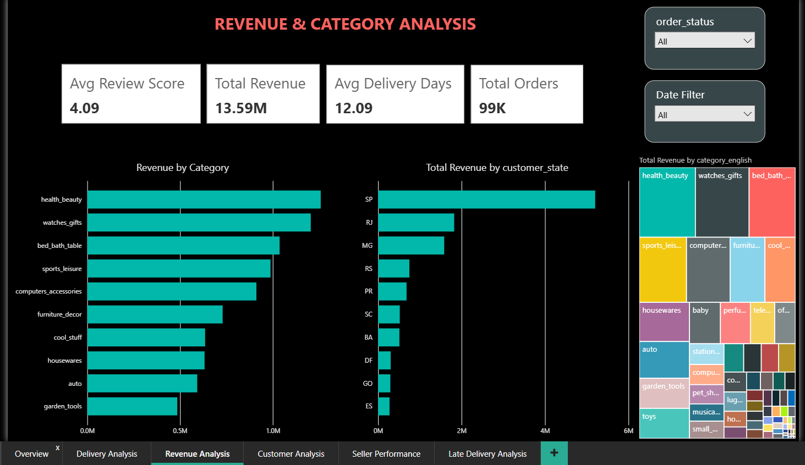

### Customer Analysis
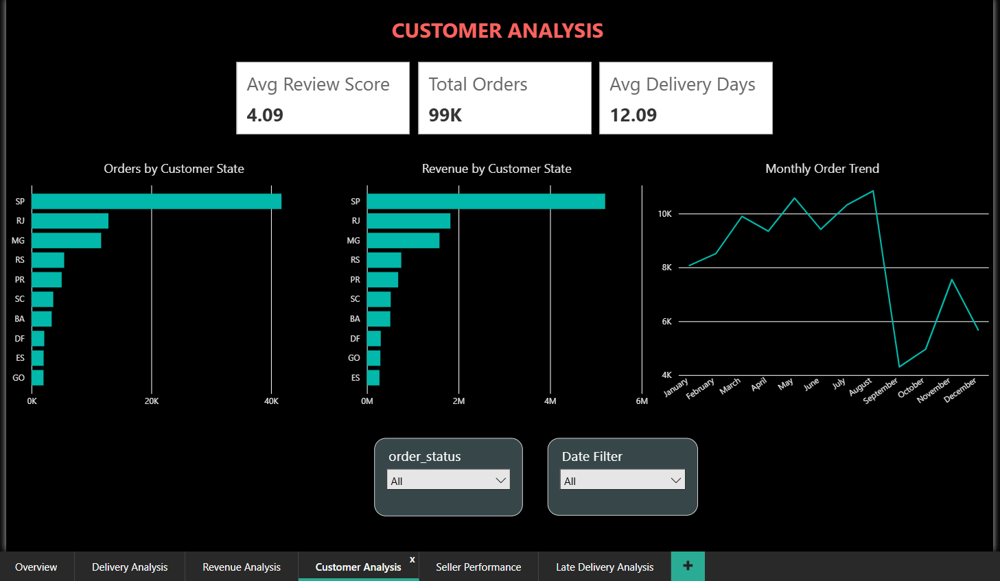

### Seller Performance
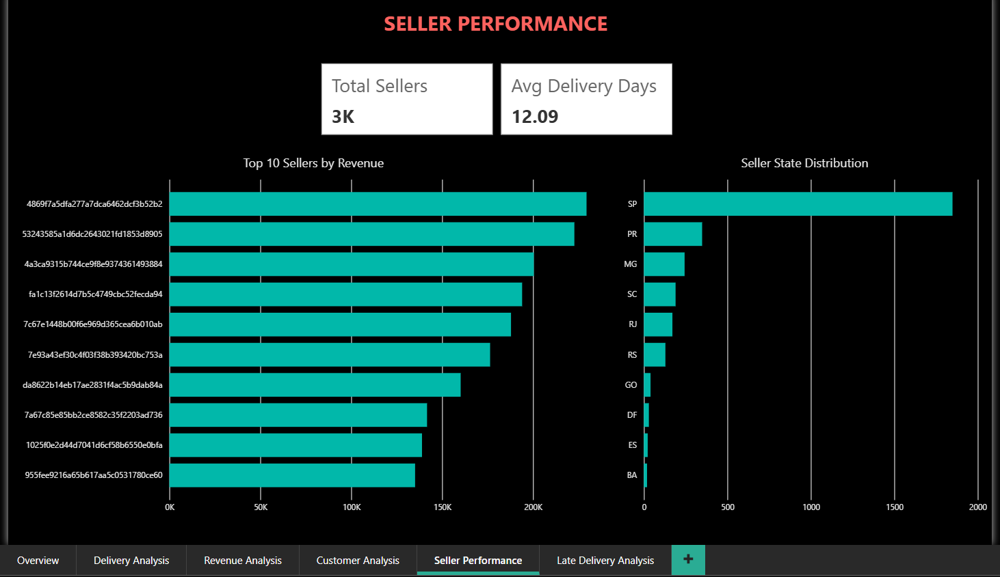

### Late Delivery Deep Dive
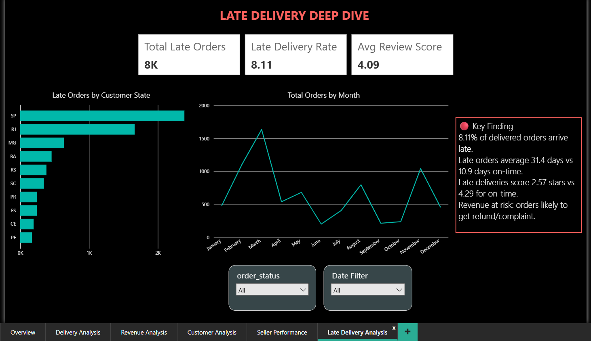

---

## 📊 Excel Analysis

### Category Performance Pivot
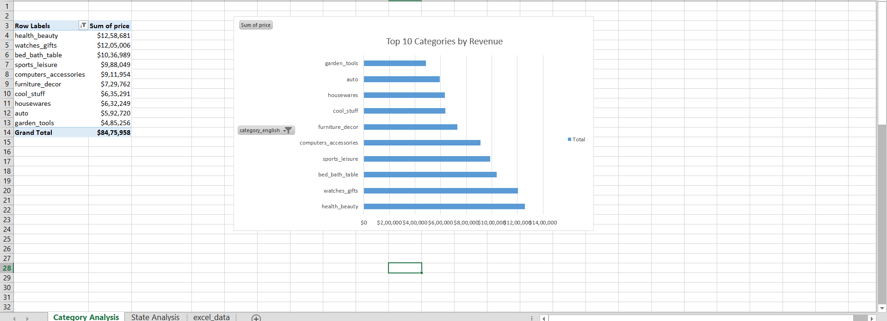

### State Performance Pivot
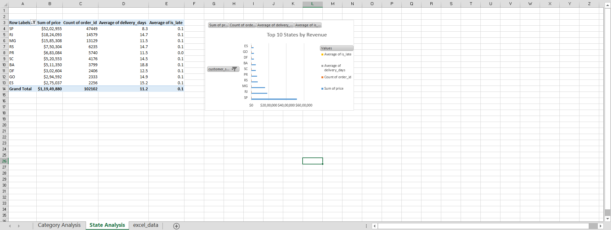

---


## 📈 Python Analysis Charts

### Chart 1 — Order Status Funnel
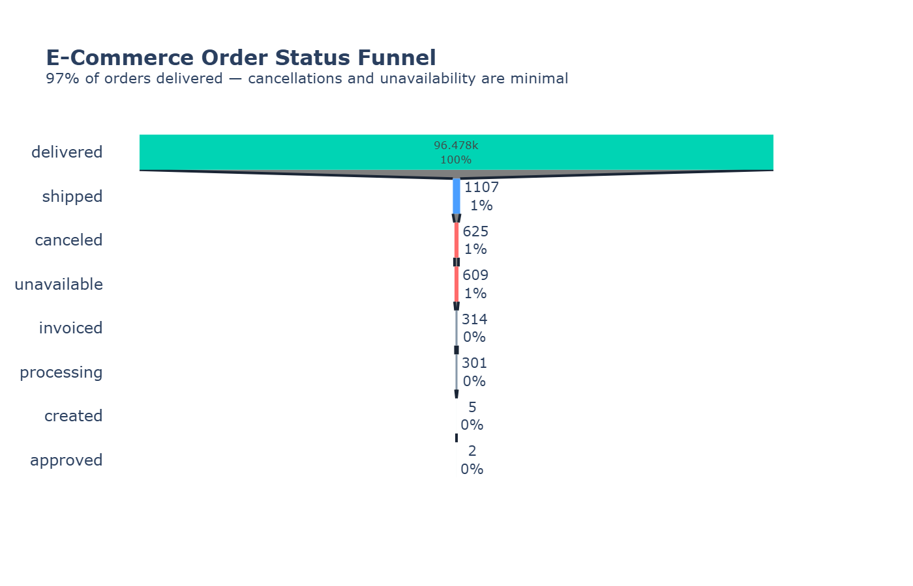

### Chart 2 — Review Score vs Delivery Days
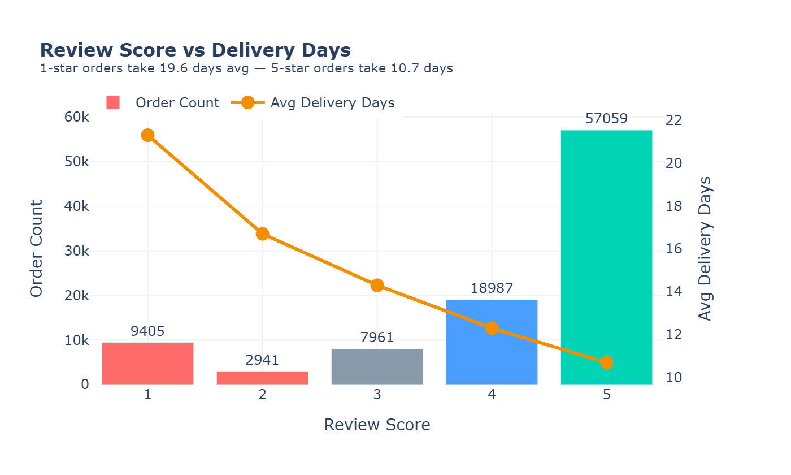

### Chart 3 — Top 10 Categories by Revenue
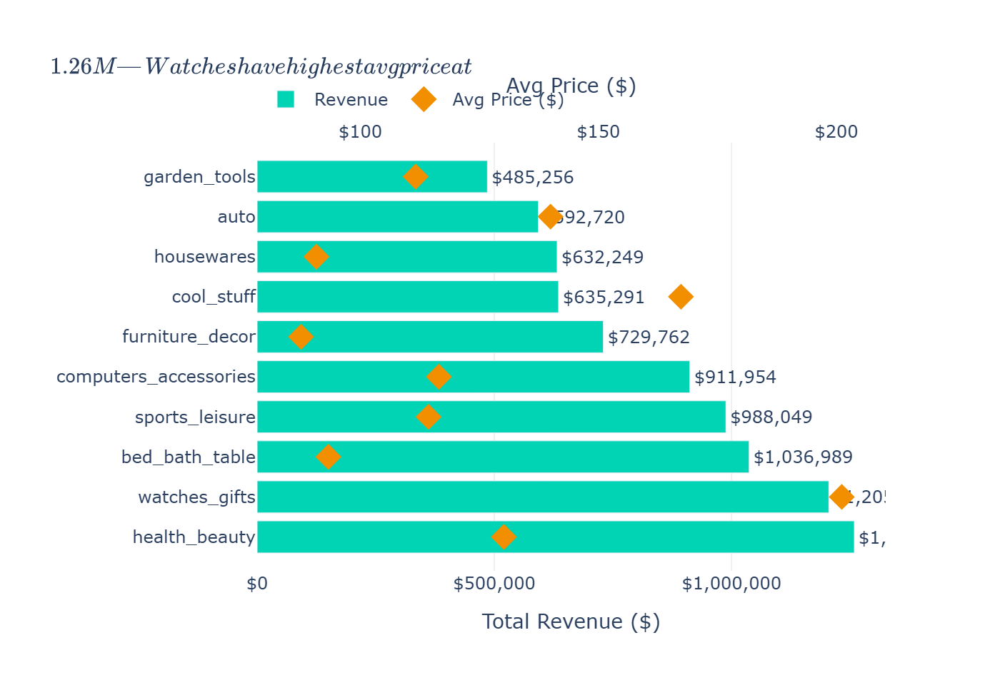

### Chart 4 — Late Delivery Impact on Satisfaction
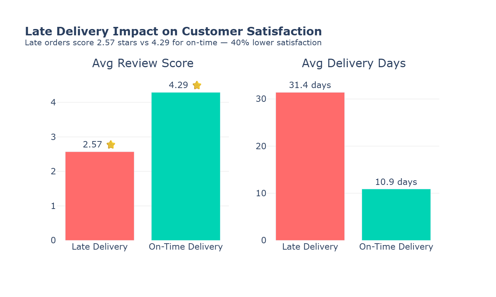

### Chart 5 — Payment Method Analysis
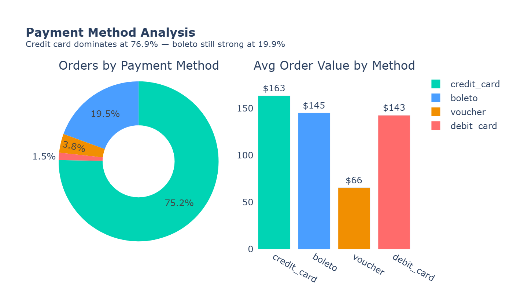

### Chart 6 — Growth Trend & Customer Retention
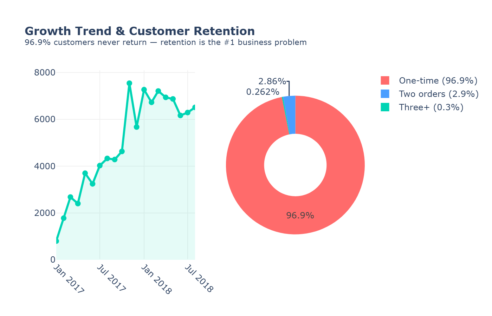


---

## 🔍 Key Business Insights

### 1. The Funnel Is Healthy — Delivery Is the Real Problem
97% of orders reach "delivered" status — cancellations and unavailability 
are minimal. The actual business risk is **delivery timing**, not order 
fulfillment.

**Recommendation:** Shift operational focus from reducing cancellations 
to improving delivery reliability.

### 2. Delivery Speed Directly Predicts Review Score
1-star reviews average **19.6 days** delivery time.  
5-star reviews average **10.7 days**.  
Every additional day of delivery measurably reduces customer satisfaction.

**Recommendation:** Treat delivery speed as a primary satisfaction lever, 
not just a logistics metric.

### 3. The Platform Over-Promises on Delivery Estimates
Actual average delivery: **12.6 days**.  
Estimated delivery shown to customer: **23.7 days**.  
The platform sets expectations 11 days slower than reality — yet late 
orders still generate the worst reviews.

**Recommendation:** Tighten delivery estimates to match real performance; 
overly conservative estimates don't protect against dissatisfaction when 
delivery does run late.

### 4. Late Delivery Devastates Customer Satisfaction
| Delivery Status | Avg Review | Avg Days |
|-----------------|-----------|----------|
| On-Time | 4.29 ⭐ | 10.9 |
| Late | 2.57 ⭐ | 31.4 |

Late orders score **40% lower** in satisfaction and take **3x longer**.

**Recommendation:** Build an early-warning system to flag at-risk 
shipments before they breach the estimated delivery date.

### 5. Credit Card Dominates, But Boleto Still Matters
Credit card: 76.9% of orders | Boleto (bank slip): 19.9% | Voucher: 3.9%

Vouchers have the lowest average order value ($66), suggesting 
discount-driven, lower-intent purchases.

**Recommendation:** Boleto remains essential for the Brazilian market — 
do not deprioritize this payment method despite credit card dominance.

### 6. Customer Retention Is the #1 Business Problem
**96.9%** of customers never place a second order.  
Only 2.9% order twice, and just 0.3% order three or more times.

This is a single-purchase marketplace — the platform is not building 
repeat relationships with customers.

**Recommendation:** Post-purchase engagement (follow-up offers, loyalty 
incentives) could meaningfully shift this number, given the high cost 
of one-time customer acquisition.

### 7. Health & Beauty and Watches Lead Revenue
Top category — Health & Beauty: **$1.26M** revenue, 8,836 orders.  
Watches & Gifts: **$1.21M** revenue with the highest average price ($201).

**Recommendation:** These categories justify deeper marketing investment 
given proven demand and high price points.

### 8. Revenue Is Heavily Concentrated in São Paulo (SP)
SP state alone generates **$5.2M** of the platform's total revenue — 
more than 4x the next highest state (RJ at $1.8M).

**Recommendation:** While SP is core, the long tail of states represents 
untapped expansion opportunity outside the dominant hub.

---

## 🗂️ Project Structure

```
ecommerce-funnel-analysis/
│
├── data/
│   ├── olist_*.csv (raw datasets)
│   ├── orders_clean.csv, items_clean.csv, etc.
│   └── excel_data.csv
│
├── sql/
│   └── analysis.py
│
├── notebooks/
│   ├── charts.py
│   ├── prep_for_powerbi.py
│   └── prep_excel.py
│
├── charts/
│   ├── chart1_order_funnel.png
│   ├── chart2_review_delivery.png
│   ├── chart3_category_revenue.png
│   ├── chart4_late_delivery_impact.png
│   ├── chart5_payment_methods.png
│   └── chart6_growth_retention.png
│
├── dashboard/
│   ├── app.py
│   ├── Ecommerce_Funnel_Dashboard.pbix
│   └── page1_overview.png → page6_late_delivery.png
│
├── excel/
│   ├── category_analysis.png
│   ├── state_analysis.png
│   └── ecommerce_analysis.xlsx
│
└── README.md
```

---

## 💻 How to Run

```bash
# 1. Clone the repo
git clone https://github.com/Purvaja11/ecommerce-funnel-analysis.git
cd ecommerce-funnel-analysis

# 2. Install dependencies
pip install pandas plotly kaleido streamlit

# 3. Run SQL analysis
python sql/analysis.py

# 4. Generate charts
python notebooks/charts.py

# 5. Run Streamlit app
streamlit run dashboard/app.py
```

---

## 📁 Dataset

Olist Brazilian E-Commerce Dataset — publicly available on Kaggle.  
99,441 orders across multiple Brazilian states, October 2016 – August 2018. 
Includes orders, items, payments, reviews, products, and sellers data.